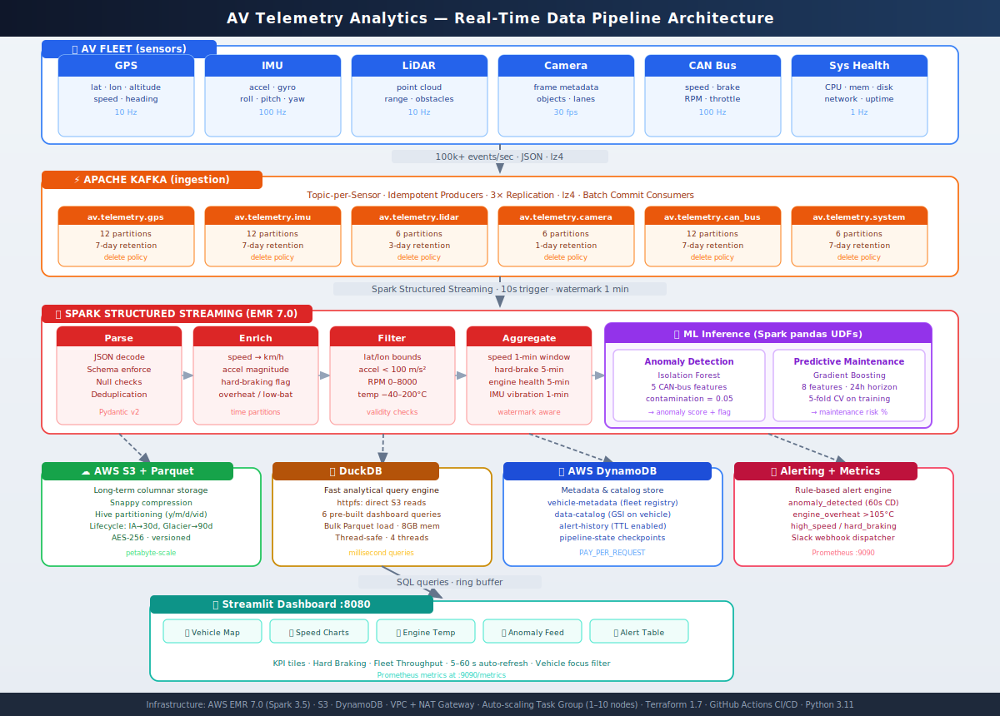

<div align="center">

# 🚗 AV Telemetry Analytics Platform

**Real-time data ingestion, stream processing, and analytics for autonomous vehicle fleets**

[](https://python.org)
[](https://kafka.apache.org)
[](https://spark.apache.org)
[](https://duckdb.org)
[](https://aws.amazon.com)
[](https://terraform.io)
[](https://streamlit.io)
[](LICENSE)
[](https://github.com/vgandhi1/av-telemetry-analytics/actions)

<br/>

*Ingest · Process · Detect · Visualize — at petabyte scale*

</div>

---

## 🗺 Architecture

<div align="center">
  
</div>

<details>
<summary><b>How data flows through the platform</b></summary>
<br/>

| Stage | What happens |
|---|---|
| **AV Fleet** | Six sensor types (GPS, IMU, LiDAR, Camera, CAN Bus, System Health) emit JSON events at up to 100 Hz per vehicle |
| **Kafka** | Events land in dedicated topics (topic-per-sensor). Producers are idempotent with lz4 compression; consumers batch-commit offsets |
| **Spark** | Structured Streaming reads all topics, parses schemas, enriches fields, filters invalids, runs windowed aggregations, and scores ML UDFs inline |
| **ML** | Isolation Forest flags anomalous sensor readings; Gradient Boosting predicts maintenance needs within a 24-hour horizon — both as Spark pandas UDFs |
| **Storage** | Processed data lands in S3 Parquet (Snappy, Hive-partitioned) for long-term storage and DuckDB for millisecond interactive queries |
| **DynamoDB** | Vehicle metadata, data catalog, alert history, and pipeline checkpoints |
| **Alerting** | Rule engine fires Slack webhooks for anomalies, overheating, high speed, and hard braking — with per-vehicle cooldowns |
| **Dashboard** | Streamlit app at `:8080` reads from DuckDB and the in-memory ring buffer, auto-refreshing every 5–60 s |

</details>

---

## ✨ Features

<table>
<tr>
<td width="50%">

### ⚡ High-Throughput Ingestion
- **100k+ events/sec** across 6 sensor types
- Topic-per-sensor Kafka architecture (12 partitions for high-frequency sensors)
- Idempotent producers with `lz4` compression and `acks=all`
- Pydantic v2 schema validation at consumer boundary
- Synthetic vehicle simulator for local dev & testing

</td>
<td width="50%">

### 🔥 Real-Time Stream Processing
- Spark Structured Streaming on AWS EMR 7.0
- Parse → Enrich → Filter → Aggregate → ML Scoring pipeline
- 5 windowed aggregations: speed, braking, engine health, vibration, fleet throughput
- Watermark-aware deduplication
- Adaptive Query Execution enabled

</td>
</tr>
<tr>
<td width="50%">

### 🤖 Inline ML Inference
- **Anomaly Detection**: Isolation Forest on 5 CAN-bus features, contamination=0.05
- **Predictive Maintenance**: Gradient Boosting, 8 features, 24-hour prediction horizon, 5-fold CV
- Both models exposed as **Spark pandas UDFs** — score directly in the streaming pipeline
- Train from historical Parquet with one command; model auto-loaded on restart

</td>
<td width="50%">

### 🗄️ Hybrid Storage Layer
- **Apache Parquet on S3**: Snappy compression, Hive partitioning `(year/month/day/vehicle_id)`, lifecycle tiers (IA→30d, Glacier→90d)
- **DuckDB**: Direct S3 reads via `httpfs`, 8GB memory, 6 pre-built dashboard queries
- **DynamoDB**: 4 tables — vehicle registry, data catalog (GSI), alert history (TTL), pipeline state
- Thread-safe batching writer with local staging before S3 upload

</td>
</tr>
<tr>
<td width="50%">

### 📊 Live Monitoring Dashboard
- Streamlit + Plotly at `http://localhost:8080`
- **Plotly Mapbox** vehicle location map colored by speed
- Speed timeseries · Engine temperature (with 105°C threshold) · Anomaly score scatter
- Hard braking bar chart · Fleet throughput area chart · Live alert feed
- Configurable 5–60 s auto-refresh and per-vehicle focus filter

</td>
<td width="50%">

### ☁️ One-Command Infrastructure
- **Terraform modules**: VPC (private subnets, NAT gateway), S3 (versioned, AES-256), DynamoDB (4 tables), EMR (auto-scaling task group 1–10 nodes)
- **GitHub Actions CI/CD**: ruff + black + mypy lint, pytest with live Kafka service container, `terraform validate`, Docker build
- Idle auto-termination for non-prod clusters
- S3 remote state with DynamoDB lock table

</td>
</tr>
</table>

---

## 🚀 Quick Start

### Prerequisites

```
Python 3.11+   Java 17 (for Spark)   Docker   AWS CLI   Terraform 1.7+
```

### 1 · Clone & install

```bash
git clone https://github.com/vgandhi1/av-telemetry-analytics.git
cd av-telemetry-analytics

python -m venv .venv && source .venv/bin/activate
pip install -r requirements.txt
cp .env.example .env          # fill in Kafka brokers + AWS credentials
```

### 2 · Start local Kafka

```bash
docker run -d --name kafka -p 9092:9092 \
  -e KAFKA_CFG_NODE_ID=1 \
  -e KAFKA_CFG_PROCESS_ROLES=broker,controller \
  -e KAFKA_CFG_CONTROLLER_QUORUM_VOTERS="1@localhost:9093" \
  -e KAFKA_CFG_LISTENERS="PLAINTEXT://:9092,CONTROLLER://:9093" \
  -e KAFKA_CFG_ADVERTISED_LISTENERS="PLAINTEXT://localhost:9092" \
  -e KAFKA_CFG_LISTENER_SECURITY_PROTOCOL_MAP="PLAINTEXT:PLAINTEXT,CONTROLLER:PLAINTEXT" \
  -e KAFKA_CFG_CONTROLLER_LISTENER_NAMES=CONTROLLER \
  -e ALLOW_PLAINTEXT_LISTENER=yes \
  bitnami/kafka:3.6
```

### 3 · Run the pipeline

```bash
# Terminal 1 — simulate 3 vehicles at 10 events/sec each
python ingestion_pipeline.py --mode produce --vehicles ZX-001 ZX-002 ZX-003

# Terminal 2 — Spark stream processing (local mode)
python stream_processing.py --debug

# Terminal 3 — monitoring dashboard
streamlit run src/monitoring/dashboard.py --server.port 8080
```

Open **[http://localhost:8080](http://localhost:8080)**

---

## 📁 Project Structure

```
av-telemetry-analytics/
│
├── 📄 ingestion_pipeline.py       ← produce synthetic telemetry OR consume → storage
├── 📄 stream_processing.py        ← Spark Structured Streaming entry point
│
├── 📂 config/
│   ├── app_config.yaml            central config with ${ENV_VAR:-default} interpolation
│   ├── kafka_config.yaml          producer/consumer tuning + topic definitions
│   ├── spark_config.yaml          SparkSession config + streaming settings
│   └── storage_config.yaml        S3, Parquet, DuckDB, DynamoDB settings
│
├── 📂 src/
│   ├── ingestion/
│   │   ├── connectors/
│   │   │   ├── schemas.py         Pydantic v2 schemas (GPS, IMU, CAN bus, LiDAR, Camera, SysHealth)
│   │   │   └── vehicle_connector.py  synthetic vehicle simulator (GPS dead-reckoning, CAN state)
│   │   ├── kafka_producer.py      idempotent producer, topic-per-sensor routing, topic creation
│   │   └── kafka_consumer.py      batch-committing consumer with schema validation
│   │
│   ├── processing/
│   │   ├── transformations.py     Spark schemas, enrichment UDFs, validity filters
│   │   ├── aggregations.py        5 windowed aggregations (speed, braking, engine, vibration, throughput)
│   │   └── ml/
│   │       ├── anomaly_detector.py        Isolation Forest + Spark pandas UDF
│   │       └── predictive_maintenance.py  Gradient Boosting + Spark pandas UDF
│   │
│   ├── storage/
│   │   ├── parquet_writer.py      thread-safe batching → local staging → S3
│   │   ├── duckdb_manager.py      DDL, bulk Parquet load, 6 dashboard query helpers
│   │   └── s3_client.py           upload, download, presign, multipart
│   │
│   └── monitoring/
│       ├── dashboard.py           Streamlit real-time dashboard (Plotly charts)
│       ├── alerting.py            rule engine, Slack webhook, per-vehicle cooldowns
│       └── metrics.py             Prometheus counters/gauges + in-memory ring buffer
│
├── 📂 terraform/
│   ├── main.tf                    root: wires VPC, S3, DynamoDB, EMR + IAM roles
│   ├── variables.tf / outputs.tf
│   └── modules/
│       ├── vpc/                   private subnets (3 AZs), NAT gateway, EMR SG
│       ├── s3/                    data bucket (versioned, lifecycle), logs bucket
│       ├── dynamodb/              4 tables with TTL, GSI, PITR
│       └── emr/                   Spark 3.5, auto-scaling task group, AQE config
│
├── 📂 tests/
│   ├── test_schemas.py            schema validation, Kafka serialization, connector
│   ├── test_storage.py            ParquetWriter batching, DuckDB DDL + insert/query
│   └── test_processing.py         anomaly detector fit/predict/save/load
│
├── 📄 .github/workflows/ci.yml    lint → test (Kafka service) → terraform validate → docker
└── 📄 Dockerfile
```

---

## 🛠 Tech Stack

| Layer | Technology | Purpose |
|---|---|---|
| Ingestion | **Apache Kafka 3.6** | Distributed, fault-tolerant event streaming |
| Processing | **Apache Spark 3.5** | Structured Streaming, windowed aggregations |
| ML | **scikit-learn** (IForest + GBM) | Inline anomaly detection & maintenance prediction |
| Long-term Storage | **Apache Parquet + S3** | Columnar, compressed, lifecycle-tiered |
| Interactive Query | **DuckDB 0.10** | Sub-second analytics, direct S3 httpfs reads |
| Metadata | **AWS DynamoDB** | Fleet registry, catalog, alert history |
| Compute | **AWS EMR 7.0** | Managed Spark, auto-scaling 1–10 task nodes |
| Dashboard | **Streamlit + Plotly** | Real-time vehicle map, charts, alert feed |
| Alerting | Rule engine + Slack | Anomaly / overheat / hard-brake notifications |
| Observability | **Prometheus** | Pipeline counters, gauges, histograms |
| IaC | **Terraform 1.7** | VPC, EMR, S3, DynamoDB — all reproducible |
| CI/CD | **GitHub Actions** | Lint, test, terraform validate, Docker build |

---

## 🤖 Machine Learning

### Training the Anomaly Detector

```bash
python -c "
from src.processing.ml.anomaly_detector import train_from_parquet
train_from_parquet('./data/parquet/can_bus', './models/anomaly_detector.pkl', sample_frac=0.2)
"
```

Once `models/anomaly_detector.pkl` exists, `stream_processing.py` auto-loads it and scores every CAN bus event inline.

**Features**: `speed_ms` · `accel_magnitude` · `steering_angle_deg` · `brake_pressure_pct` · `engine_temp_celsius`

### Training the Maintenance Predictor

```python
from src.processing.ml.predictive_maintenance import MaintenancePredictor

predictor = MaintenancePredictor(n_estimators=200, learning_rate=0.05)
predictor.fit(training_df)          # needs 'needs_maintenance_24h' label column
print(predictor.feature_importance())
predictor.save('./models/maintenance_predictor.pkl')
```

---

## ☁️ Infrastructure

```bash
cd terraform
terraform init
terraform plan  -var="environment=dev"
terraform apply -var="environment=dev"
```

| Module | Provisions |
|---|---|
| `vpc` | VPC · 3 private subnets across AZs · NAT gateway · EMR security group |
| `s3` | `av-telemetry-data-{env}` — versioned, AES-256, lifecycle tiers |
| `dynamodb` | 4 tables: vehicle-metadata · data-catalog (GSI) · alert-history (TTL) · pipeline-state |
| `emr` | Spark 3.5 on EMR 7.0 · auto-scaling task group · AQE · idle auto-termination (non-prod) |

---

## 🧪 Testing

```bash
pytest tests/ -v --cov=src --cov-report=term-missing
```

| Test file | Covers |
|---|---|
| `test_schemas.py` | Pydantic validation, vehicle ID format, Kafka key/value serialization, connector event variety |
| `test_storage.py` | ParquetWriter batching / flush / S3 skip, DuckDB DDL creation, insert + query round-trip |
| `test_processing.py` | IForest fit/predict, anomalous score ranking, save/load, pre-fit error guard |

Tests use `tmp_path` fixtures — **no external services required** at test time.

---

## ⚙️ Configuration

All config lives in [`config/app_config.yaml`](config/app_config.yaml) with `${ENV_VAR:-default}` interpolation — override anything via environment variables, no code changes needed.

| Key | Default | Description |
|---|---|---|
| `kafka.bootstrap_servers` | `localhost:9092` | Kafka broker list |
| `spark.master` | `local[*]` | Spark master URL |
| `spark.checkpoint_dir` | `/tmp/spark-checkpoints` | Streaming checkpoint path |
| `storage.s3_bucket` | `av-telemetry-data` | S3 data bucket |
| `storage.duckdb_path` | `./data/telemetry.duckdb` | DuckDB file path |
| `monitoring.dashboard_port` | `8080` | Streamlit port |
| `ml.anomaly_detection.contamination` | `0.05` | IForest contamination rate |

---

## 🤝 Contributing

1. Fork → `git checkout -b feature/your-feature`
2. `pre-commit install` (runs ruff + black on commit)
3. Add tests for new functionality
4. `pytest tests/ -v` and `ruff check src/` must pass
5. Open a PR against `main`

---

<div align="center">

**Built with Python 3.11 · Apache Kafka · Apache Spark · DuckDB · AWS · Terraform**

[⬆ Back to top](#-av-telemetry-analytics-platform)

</div>
